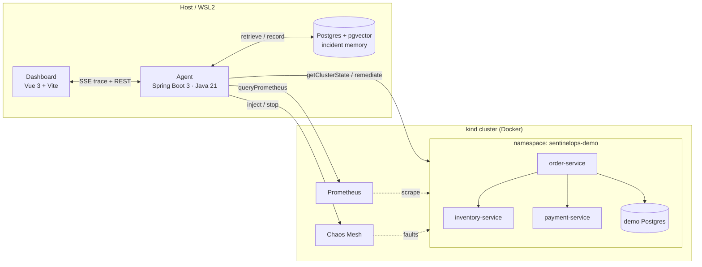

# SentinelOps

**A self-healing Kubernetes platform with retrospective incident memory.**

Most self-healing infra reacts to symptoms (`CPU high → scale up`). SentinelOps is
different: when it detects an anomaly it first **retrieves the most similar past
incident** from a knowledge base of real, public postmortems (Cloudflare, AWS,
GitHub, GitLab, Meta, …) plus its own history — and uses that precedent's root
cause and proven fix to inform remediation, instead of guessing from scratch. Every
step is shown live on a dashboard: the anomaly, the retrieved precedent (with
source link), the agent's reasoning, the action, and the before/after metrics.

> An SRE agent with **institutional memory**, not just a reflex.

---

## What "done" looks like

Run one script, open the dashboard, click **"inject pod-kill on
inventory-service"**, and watch — in real time — the agent detect the anomaly,
retrieve and display a relevant real postmortem, explain its reasoning, fix it,
and show the metrics recovering.

▶ **[docs/DEMO.md](docs/DEMO.md)** — four scenarios + a 5-minute interview script.

---

## Architecture



The agent's decision loop and the component/sequence diagrams are in
**[docs/ARCHITECTURE.md](docs/ARCHITECTURE.md)**.

| Layer            | Tech                                                            |
|------------------|----------------------------------------------------------------|
| Demo workload    | Java 21, Spring Boot 3 (order / inventory / payment) + Postgres |
| Cluster          | `kind` (Kubernetes-in-Docker) + Helm                           |
| Observability    | Prometheus (Grafana optional)                                  |
| Chaos injection  | Chaos Mesh (pod-kill, network-delay, network-partition, CPU)   |
| Incident memory  | PostgreSQL + `pgvector`, hybrid structured + vector retrieval   |
| Agent            | Java 21, Spring Boot 3 — tools, decision loop, guardrails       |
| Dashboard        | Vue 3 + Vite + TypeScript, live trace over SSE                 |

---

## Quick start

Designed for **Windows → WSL2 (Ubuntu) + Docker Desktop**. Inside WSL you need
`docker`, `kubectl`, `kind`, `helm` (and `java 21` / `node 18+` for local dev).

```bash
./scripts/preflight.sh            # check tooling
cp .env.example .env

./scripts/setup.sh                # Postgres + kind cluster
./scripts/install-observability.sh
./scripts/install-chaos-mesh.sh
./scripts/deploy-workload.sh      # build + deploy the 3 demo services

cd agent && mvn spring-boot:run & # agent on :8090 (auto-ingests 38 postmortems)
cd dashboard && npm install && npm run dev   # dashboard on :5173
```

Then run a scenario and watch the dashboard:

```bash
./scripts/demo.sh cpu-stress
```

Full per-phase setup/verify and the test suites are in
**[docs/RUNBOOK.md](docs/RUNBOOK.md)**.

---

## Design highlights

- **Retrieval reflects the *kind* of incident, not just similar words.** Two
  stages: pgvector cosine recall, then a re-rank that blends similarity with a
  **structured incident signature** (symptom type, error-pattern category,
  service-type overlap). A test asserts a network/latency query returns network
  incidents — never crashes — and a CPU query surfaces the Cloudflare regex outage.

- **The precedent drives the fix.** If the nearest retrieved postmortem is a bad
  deployment/config change, the agent **rolls back**; otherwise it maps the live
  symptom to a **restart** or **scale-up**. Every decision cites the precedent it used.

- **Safety is enforced in code, not prompts.** Namespace allow-list (refuses
  anything outside `sentinelops-demo`), a live **dry-run** toggle, and the
  justification is **logged before** every action. All unit-tested.

- **Runs with zero external dependencies.** Embeddings default to a local,
  dependency-free embedder and the planner defaults to a deterministic rule engine
  — so the whole thing (and CI) runs with **no API key**. Set `AGENT_PLANNER=llm`
  (+ `OPENAI_API_KEY`) to reason with an LLM via **Spring AI**'s `ChatClient`
  (OpenAI-compatible — works with OpenAI, Azure, or a local vLLM); a bad/unreachable
  endpoint falls back to the rule-based planner automatically. Set
  `EMBEDDING_PROVIDER=openai` similarly for real semantic embeddings.

- **The memory grows.** Every incident the agent resolves is embedded and written
  back into the same store, tagged `source=sentinelops`.

- **Real, safely.** Services, cluster, Prometheus, Chaos Mesh, and pgvector are all
  real and local. The postmortems are **curated original summaries** of real public
  incidents, each linked to its `source_url` — no source text redistributed.

---

## Repository layout

```
.
├── services/          demo microservices (order / inventory / payment)  — Phase 2
├── helm/              sentinelops-demo chart                            — Phase 2
├── infra/             db bootstrap, kind config, observability manifests
├── chaos/             Chaos Mesh docs + trigger helper                  — Phase 4
├── incident-memory/   dataset schema + validator (dataset lives in agent) — Phase 5
├── agent/             Spring Boot agent: tools, memory, planner, loop   — Phases 3,5,6
├── dashboard/         Vue 3 + Vite + TS SPA                             — Phase 7
├── scripts/           setup / teardown / per-phase installers / demo (bash, WSL2)
└── docs/              ARCHITECTURE · RUNBOOK · DEMO
```

---

## Project status — all phases complete

- [x] **Phase 1 — Scaffolding**: monorepo, `docker-compose` (Postgres + pgvector), kind bootstrap.
- [x] **Phase 2 — Demo microservices**: order/inventory/payment saga on kind via Helm; cascading-failure hook.
- [x] **Phase 3 — Observability**: Prometheus (annotation scraping) + a tested `queryPrometheus` client.
- [x] **Phase 4 — Chaos**: Chaos Mesh + four experiments behind a guardrailed API.
- [x] **Phase 5 — Incident memory**: 38 curated postmortems, pgvector, hybrid retrieval + quality tests.
- [x] **Phase 6 — Agent**: detect→retrieve→reason→remediate→verify→record loop, tools, safety guardrails.
- [x] **Phase 7 — Dashboard**: cluster view, chaos triggers, live SSE reasoning trace, before/after charts.
- [x] **Phase 8 — Scenarios + polish**: four demo scenarios, diagrams, interview script.

**Test coverage** (all run without a cluster): 6 service tests, 32 agent tests
(retrieval quality, planner, guardrails, Kubernetes mock), dashboard typecheck + build.

## License

TBD before publishing.
