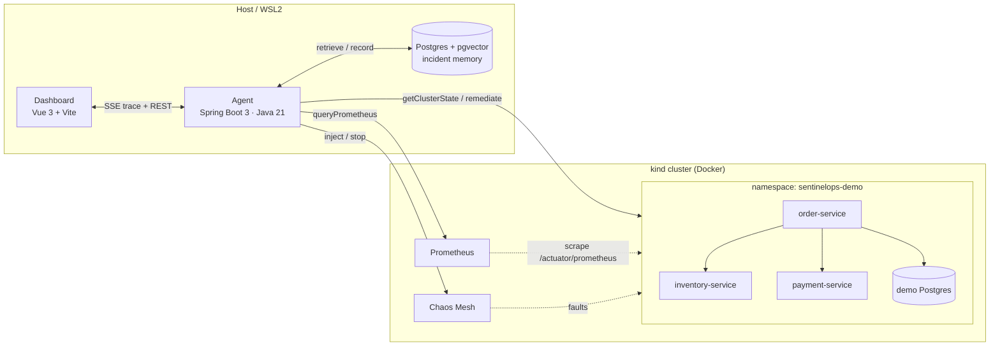
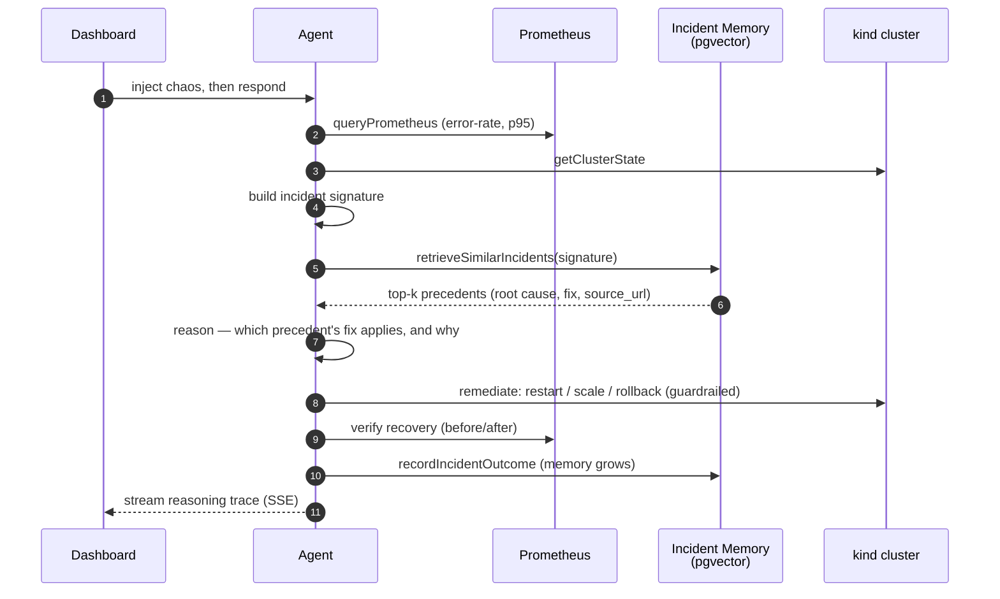

# SentinelOps — Architecture

> Skeleton. Fleshed out with a rendered diagram in Phase 8. This captures the
> intended component boundaries so every phase builds toward the same picture.

## One-liner
An SRE agent with **institutional memory**: on a Kubernetes anomaly it retrieves
the most similar *real* past incident (from public postmortems + its own
history), reasons over that precedent's root cause and fix, then remediates —
instead of reacting from scratch.

## Components

## Incident-response loop

## Data flow: one incident
1. **Detect** — agent polls `queryPrometheus` for latency/error-rate/resource
   anomalies in `sentinelops-demo`.
2. **Signature** — build a structured signature: `service_types`,
   `error_pattern_category`, `symptom_type`.
3. **Retrieve** — `retrieveSimilarIncidents(signature)` = structured match +
   pgvector cosine, top-k.
4. **Reason** — LLM decides which precedent's fix applies and why.
5. **Remediate** — `remediate(action, target)` (restart/scale/rollback), inside
   the sandbox namespace only, dry-run aware.
6. **Verify** — watch post-action metrics recover.
7. **Record** — `recordIncidentOutcome(...)` embeds and writes the resolved
   incident back into the same store.

## Safety model
- Namespace allow-list (`sentinelops-demo`); refuses everything else.
- Dry-run mode.
- Every remediation logged with justification **before** execution.

## Trust boundaries
- The LLM sees metrics, logs, cluster state, and retrieved precedents — all
  treated as **data**. Tool calls are the only way it affects the cluster, and
  every tool enforces the namespace guardrail server-side (not by prompt).
